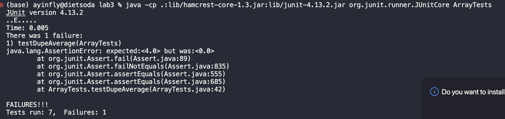

## Part 1
The code for my StringServer is here:
```
import java.io.IOException;
import java.net.URI;

class Handler implements URLHandler {
    String str = "";

    public String handleRequest(URI url) {
        if (url.getPath().equals("/")) {
            return str;
        } else {
            System.out.println("Path: " + url.getPath());
            if (url.getPath().contains("/add-message")) {
                String[] parameters = url.getQuery().split("=");
                if (parameters[0].equals("s")) {
                    str += parameters[1] + "\n";
                    return str;
                }
            }
            return "404 Not Found!";
        }
    }
}

class NumberServer {
    public static void main(String[] args) throws IOException {
        if(args.length == 0){
            System.out.println("Missing port number! Try any number between 1024 to 49151");
            return;
        }

        int port = Integer.parseInt(args[0]);

        Server.start(port, new Handler());
    }
}
```
Below are two instances of me using it:


For the two screenshots, handleRequest is called which takes a URI as input. The variables are the path which is /add-message for both, the query, which is split by an '=' sign, and the parameter which is either 13 or dinosaur. There is a value for the str field which starts with a blank string, but gets updated with the parameter of each use of the handleRequest method.

## Part 2
A failure inducing input:
```
@Test
public void testDupeAverage() {
    double [] input1 = {4, 4, 4, 4, 4};
    assertEquals(4, ArrayExamples.averageWithoutLowest(input1), 0.001);
}
```
A successful input:
```
@Test
public void testOrderedAverage() {
    double [] input1 = {0, 1, 2, 3, 4, 5};
    assertEquals(3, ArrayExamples.averageWithoutLowest(input1), 0.001);
}
```
The output:

The before and after code to fix:
```
static double averageWithoutLowest(double[] arr) {
    if(arr.length < 2) { return 0.0; }
    double lowest = arr[0];
    for(double num: arr) {
      if(num < lowest) { lowest = num; }
    }
    double sum = 0;
    for(double num: arr) {
      if(num != lowest) { sum += num; }
    }
    return sum / (arr.length - 1);
}
```
```
static double averageWithoutLowest(double[] arr) {
    if(arr.length < 2) { return 0.0; }
    double lowest = arr[0];
    for(double num: arr) {
      if(num < lowest) { lowest = num; }
    }
    double sum = 0;
    for(double num: arr) {
        sum += num;
    }
    return (sum - lowest) / (arr.length - 1);
}
```
The original issue was that the lowest number was recorded as a value, but any number equal to the lowest value would be dropped. I fixed this by subtracting the lowest value only one time. This fixes the issue because the lowest value cannot be repeatedly dropped like before.

## Part 3
I learned that Junit testing is very helpful for testing errors as you can quickly work through potential issues and easily find out what you need to fix based on what exactly goes wrong. The tests I wrote allow me to see the specific edge cases that didn't work which allowed debugging to be much easier and fluid.
