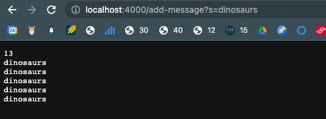

## Part 1
The code for my StringServer is here:
```
import java.io.IOException;
import java.net.URI;

class Handler implements URLHandler {
    String str = "";

    public String handleRequest(URI url) {
        if (url.getPath().equals("/")) {
            return str;
        } else {
            System.out.println("Path: " + url.getPath());
            if (url.getPath().contains("/add-message")) {
                String[] parameters = url.getQuery().split("=");
                if (parameters[0].equals("s")) {
                    str += parameters[1] + "\n";
                    return str;
                }
            }
            return "404 Not Found!";
        }
    }
}

class NumberServer {
    public static void main(String[] args) throws IOException {
        if(args.length == 0){
            System.out.println("Missing port number! Try any number between 1024 to 49151");
            return;
        }

        int port = Integer.parseInt(args[0]);

        Server.start(port, new Handler());
    }
}
```
Below are two instances of me using it:




For the two screenshots, handleRequest is called which takes a URI as input. The values taken are the path which is 
/add-message for both, the query, which is split by an '=' sign, and the parameter which is either 13 or dinosaur.
