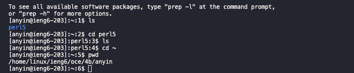

# Lab Report 1

---


## Installing VScode
* To install VScode you must first go to [here](https://code.visualstudio.com/)
* Click on the big blue button to download the proper version or the small arrow next to it to download a specific version 


## Remotely Connecting
* In order to remotely connect to a school server, you must first grab your cse15l username at [https://sdacs.ucsd.edu/~icc/index.php](https://sdacs.ucsd.edu/~icc/index.php)
* After that open visual code and open the terminal from within VScode (ctrl + ~ on mac) and enter the following
```
$ ssh cs15lsp23##@ieng6.ucsd.edu
```
* The hashtags are replaced by your unique 2 letter code to login to the remote server
* Now you will be prompted for your password which you should type in 
* Your password will not show when your are in the progress of typing, but that is perfectly normal
* When you have finished logging into the server, you should reach a screen that looks a little like this:


## Trying Some Commands
* Now that you are logged into the server, try exploring using commands
* Some common ones you could try are cd, ls, pwd, mkdir, and cp interwoven with file directories and names
* These stand for change directory, list files, print working directory, make directory, and copy respectively 
* One command I tried is the following
```
$ cat <file>
```
* This prints out the contents of <file> into the terminal
* Another command I had tried is
```
$ mkdir <folder>
```
* This makes a new folder at your current location if one does not already exist
* Try running these commands on both your virtual server and your personal computer to observe the differences in files
* After this, you are done
* Your commands should look something like this, but with file differences depending on where you are logged in:


