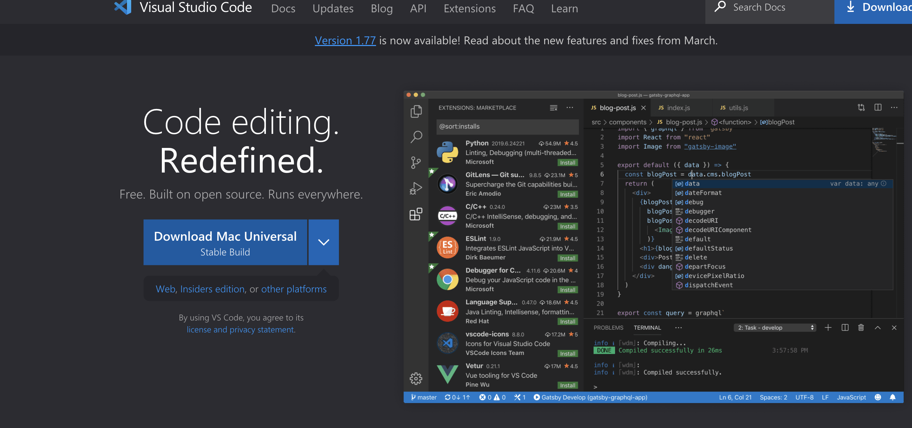
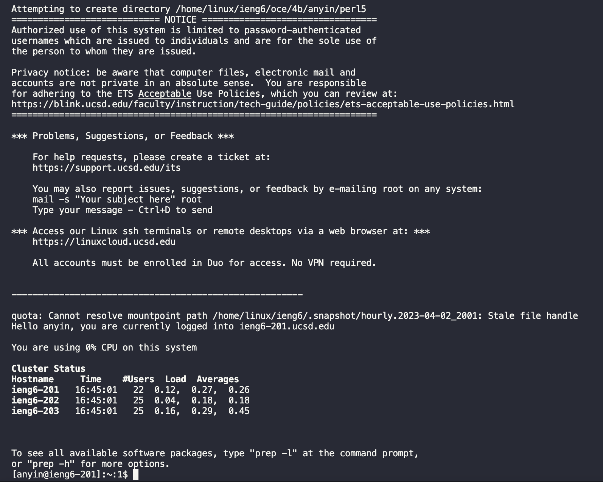

# Lab Report 1

---

## Installing VScode
* To install VScode you must first go to [https://code.visualstudio.com/](https://code.visualstudio.com/)
* Click on the big blue button to download the proper version or the small arrow next to it to download a specific version 

## Remotely Connecting
* In order to remotely connect to a school server, you must first grab your cse15l username at [https://sdacs.ucsd.edu/~icc/index.php](https://sdacs.ucsd.edu/~icc/index.php)
* After that open visual code and open the terminal (which can be opened with ctrl + ~ on mac)
* You should enter ssh cs15lsp23##@ieng6.ucsd.edu where the hashtags are replaced by your unique 2 letter code
* Now you will be prompted for your password which you should type in 
* Your password will not show when your are in the progress of typing, but that is perfecy normal
* When you have finished logging into the server, you should reach a screen that looks a little like this:

## Trying Some Commands
