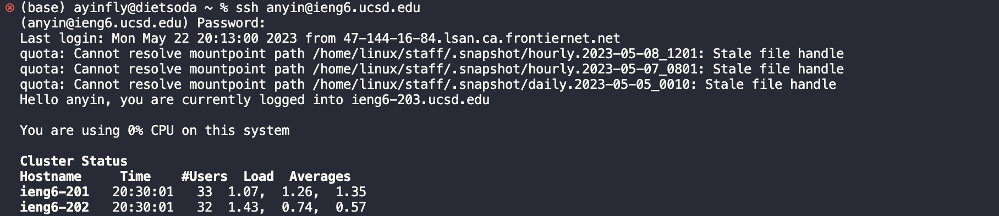
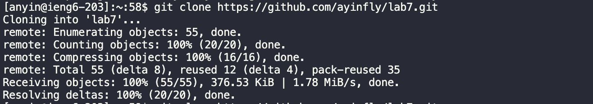
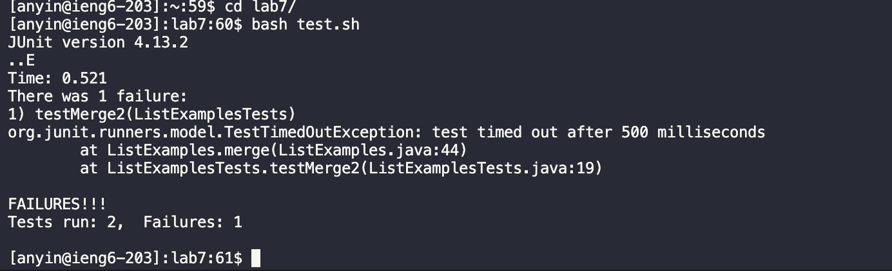
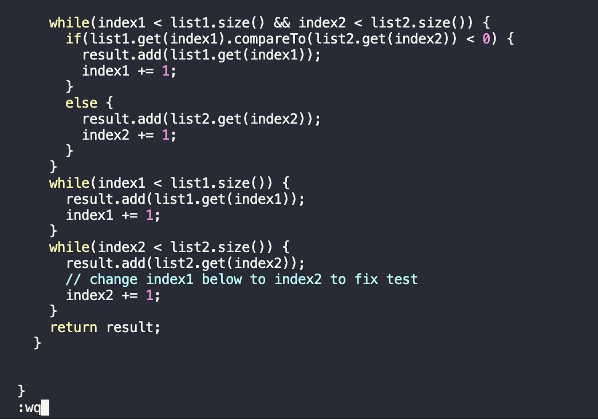
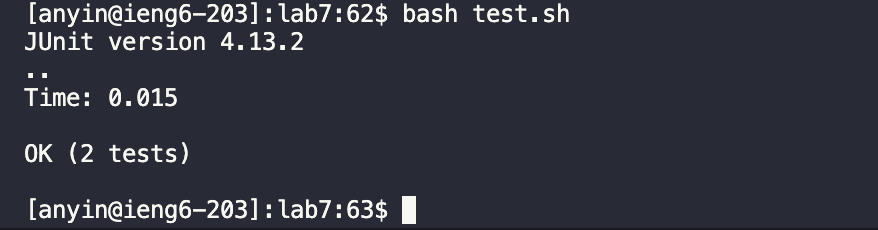
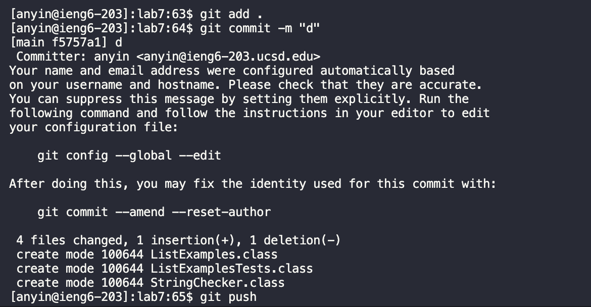

# Lab Report 4
---
# 1. Log into ieng6
Keys pressed: 
```
<up><enter><command-v><enter>
```
 My search history contained the last instance of me loggin into the ieng6 account, so the command was used by pressing the up arrow and then enter. My password was copied to my clipboard and since I had a mac, using cmd + v was sufficient to input the password. Pressing enter again allowed me to log in.

# 1. Clone your fork of the repository from your Github account
Keys pressed:
```
<up><up><enter>
```
Since the last instance of the ieng account had cloned the fork and then deleted the directory, I had to use up twice to acheive the clone command which was then submitted using enter.

# 3. Run the tests, demonstrating that they fail
Keys pressed:
```
cd l<tab><enter>bash t<tab><enter>
```
cd l + tab allowed me to enter the lab7 directory quickly since tab autocompleted to the only directory starting with an l. bash t + tab allowed me to quickly run the test.sh file since it autocompleted to the only file starting with a t in lab 7. This produced the following results which demonstrated that the tests failed.

# 4. Edit the code file to fix the failing test
Keys pressed:
```
vim L<tab>.<tab><enter>43jexi2<esc>:wq<enter>
```
vim L + tab + . + tab allows me to open up ListExamples.java in vim relatively easily as L + tab allows me to autofill to ListExamples and . + tab leads to ListExamples.java as the only file with those criteria. 43j jumps down 43 spaces to the error line while e jumps to the end of the first word which contains the error. x deletes the number there while i2 inserts 2. esc allows for typing while :wq saves the file which enter inputs.

# 5. Run the tests, demonstrating that they now succeed
Keys pressed:
```
<up><up><enter>
```
Since the previous bash command was used right before opening up the file in vim, going up twice in the history takes me there while enter submits the command to demonstrate the tests now pass.

# 6. Commit and push the resulting change to your Github account
Keys pressed:
```
git add . <enter> git commit -m "message" <enter> git push
```
Git add adds all the files to be commited while git commit -m "message" prepares the commits for Github while git push pushes the changes to github and finalizes them

