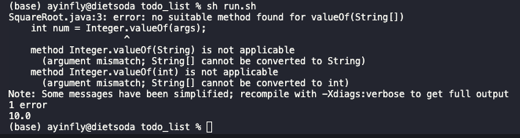

# Lab Report 5
---
Student: Hi my script to take the square root of a number appears to be working, but continually spouts out errors. The setup of my code is a java script which should take in an input through main and then outputs the square root to the terminal, which it does correctly, but also spits out an error. I use a bash file to run my code and it is currently hard coded to the square root of 100, which is taken correctly

TA: Your error states that Integer.valueOf() is taking a String[] when it should be taking a String, how could you convert that array into a single object?

Student: Hi I have now fixed the bug by doing args[0] instead of args for Integer.valueOf() as I realized my one item input was still being parsed as an array and I had to get the first item of that array using array indices. Thank you for that!

## pt2

I learned why vim is so useful as the commands combined allow you to do any task with relative ease, and with a lot of memorization, you could probably make your coding process much more efficient
