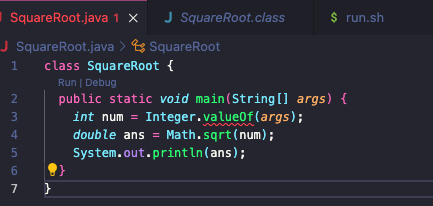
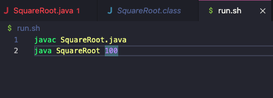

# Lab Report 5
---
Student: Hi my script to take the square root of a number appears to be working, but continually spouts out errors. The setup of my code is a java script which should take in an input through main and then outputs the square root to the terminal, which it does correctly, but also spits out an error. I use a bash file to run my code and it is currently hard coded to the square root of 100, which is taken correctly

